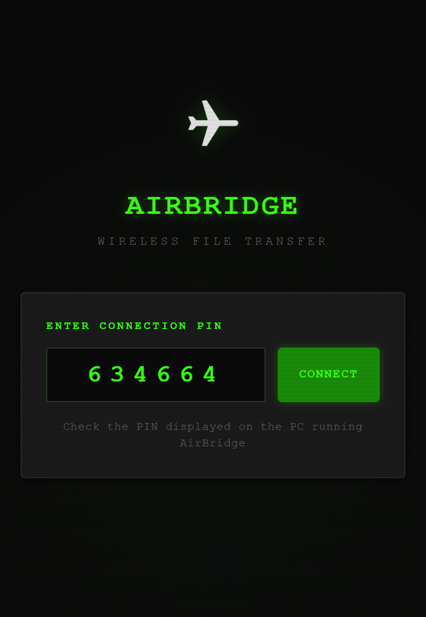
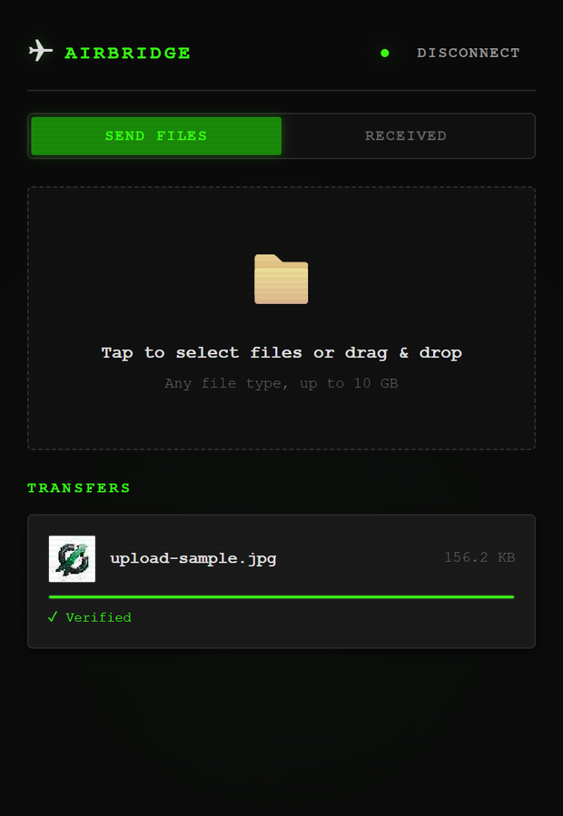
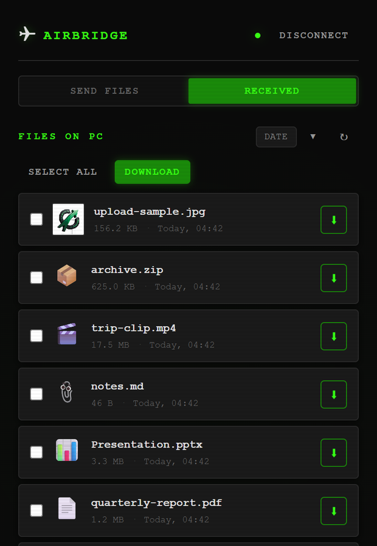

<div align="center">

# AirBridge

**Wireless file transfer between a Windows PC and an iPhone, over your own network.**
*The phone installs nothing. The network needs no internet. Nothing is uploaded anywhere.*

[](https://github.com/nkVas1/AirBridge/releases/latest)
[](https://github.com/nkVas1/AirBridge/actions/workflows/ci.yml)
[](#requirements)
[](#how-it-works)
[](LICENSE)

&nbsp;&nbsp;&nbsp;&nbsp;

</div>

---

## What is this?

Moving a file between a Windows PC and an iPhone is a solved problem
everywhere except between those two devices. AirDrop stops at the edge of
the Apple ecosystem. A cable needs software on the PC and still argues
about file types. Everything else routes a private file through somebody
else's server to travel three metres.

The tools that do solve it each ask for something:

| | on the phone | needs internet | notes |
|---|---|---|---|
| **AirDrop** | built in | no | Apple devices only — no Windows |
| **[LocalSend](https://github.com/localsend/localsend)** | install an app | no | both ends need the app; the better choice if you don't mind installing one |
| **[PairDrop](https://github.com/schlagmichdoch/PairDrop)** | browser only | **yes**¹ | a signalling server has to introduce the peers |
| **[qrcp](https://github.com/claudiodangelis/qrcp)** | browser only | no | one-shot terminal transfer; no session, no progress, bring your own certificate |
| **Windows Phone Link** | built in | yes | iPhone → PC only, and file types depend on the sending app |
| **Cloud drives** | install an app | **yes** | the file leaves your network |
| **AirBridge** | **browser only** | **no** | a session that stays open, with previews, progress and resume |

¹ *PairDrop can be self-hosted for offline use, which means running Node and
a STUN/TURN setup of your own.*

The gap AirBridge fills is narrow and real: nothing to install on the
phone, nothing outside the room, **and** a session that behaves like an
app rather than a single shot. You run a small server on the PC; the
phone opens it in Safari and stays connected — sending, browsing what has
arrived, previewing it, pulling files back. It works on a hotel network,
and on an iPhone Personal Hotspot with cellular data switched off.

**It is a personal tool, not a product.** No account, no telemetry, no
update channel, no support commitment. If installing an app on the phone
is acceptable, LocalSend is more capable and better maintained, and this
README would rather say so than pretend otherwise.

## How it works

```
   Windows PC                                        iPhone
┌────────────────────┐                        ┌────────────────────┐
│  python -m         │                        │                    │
│    airbridge       │   1. scan the QR code  │  Camera app        │
│                    │ ─────────────────────► │       │            │
│  ┌──────────────┐  │                        │       ▼            │
│  │ aiohttp      │  │   2. TLS 1.3 handshake │  ┌──────────────┐  │
│  │  HTTPS + WSS │◄─┼────────────────────────┼─►│ Safari       │  │
│  │              │  │      AES-256-GCM       │  │  PWA, no     │  │
│  │  PIN auth    │  │                        │  │  install     │  │
│  │  SHA-256     │  │   3. 64 KB chunks,     │  └──────────────┘  │
│  └──────┬───────┘  │      either direction, │                    │
│         │          │      resumable         │                    │
│  ~/Downloads/      │   4. mDNS announce     │                    │
│    AirBridge_...   │ ◄──────────────────────┤  airbridge.local   │
└────────────────────┘                        └────────────────────┘
         └─ your router, or the phone's own hotspot ─┘
                     no path to the internet
```

Metadata travels as JSON text frames, file bytes as binary frames on the
same socket. The server writes each chunk straight to disk and hashes it
as it goes, so memory use does not scale with file size.

**Interrupted transfers continue.** An upload lands in a scratch file
named for its size; reconnecting reports how much survived and the phone
sends only the rest. **Both ends hash independently** and compare, so
"Complete" means the right bytes arrived, not merely that bytes did.

### Why HTTPS, for a thing on your own LAN

Not for the padlock. Browsers gate half their capabilities behind a
*secure context*: on a plain `http://192.168.x.x` page, `crypto.subtle`
is undefined and `navigator.serviceWorker` does not exist, so offline
caching is impossible before you write a line of it. TLS also keeps
anyone else on the same Wi-Fi from reading the file in transit.

No certificate authority will vouch for `192.168.1.5`, so AirBridge is
its own authority: a CA generated on first run, and a server certificate
under it re-issued whenever your address changes. Certificates are built
to [Apple's published requirements](https://support.apple.com/103769) —
`serverAuth` in ExtendedKeyUsage, a DNS name in the SAN, under 398 days —
because iOS rejects certificates that miss any of them outright.

**Install the certificate once** and the warnings stop for good. Open
`https://<address>/ca.crt` on the phone, then *Settings → Profile
Downloaded → Install*, then *Settings → General → About → Certificate
Trust Settings* and switch AirBridge on. The terminal prints the SHA-256
fingerprint so you can check it is your machine and not someone else's.

**If you don't, it still works.** Safari refuses a WebSocket to an
untrusted certificate even after you accept the warning for the page, so
a certificate you skipped would otherwise leave you with an app that
loads and then moves nothing. The server therefore also listens on plain
HTTP one port up; when the encrypted socket will not open, the web app
says why and offers that address with the PIN already in it. Encryption
is the default and the way around it is one tap.

`--no-tls` serves plain HTTP only. `--no-http-fallback` closes the
unencrypted port.

## Quick start

```bash
pip install git+https://github.com/nkVas1/AirBridge
airbridge
```

Or from a checkout — `start.bat` on Windows, `start.sh` elsewhere, both
of which create a virtual environment first:

```bash
git clone https://github.com/nkVas1/AirBridge
cd AirBridge
pip install -r requirements.txt
python -m airbridge
```

The terminal prints the address, the PIN, and a QR code:

```
================================================================
  AirBridge - Wireless File Transfer
================================================================

  Open on the phone:  https://192.168.1.59:8090
  Connection PIN:     482901
  Downloads folder:   C:\Users\you\Downloads\AirBridge_Downloads

  Point the phone camera at this code:

        █████████████████████████████████████
        ████ ▄▄▄▄▄ █▀  ▄▄▄▀▀  █▀██ ▄▄▄▄▄ ████
        ████ █   █ ██ ▄▀█  ▀▄▄▀▀▄█ █   █ ████
        ████ █▄▄▄█ █▄█   ▀▄██▄█▄ █ █▄▄▄█ ████
        ████▄▄▄▄▄▄▄█▄▀ █▄▀ █ █ ▀ █▄▄▄▄▄▄▄████
                        ( ... )
        █████████████████████████████████████

  First time on this phone, to avoid warnings and make sure
  transfers can be encrypted, install the AirBridge
  certificate from  https://192.168.1.59:8090/ca.crt
    iOS: Settings > Profile Downloaded > Install, then
         Settings > General > About > Certificate Trust Settings
  Authority SHA-256: 21:25:9A:87:E0:F3:B3:47:...

  If the phone will not connect over HTTPS, this address
  always works, without encryption:
    http://192.168.1.59:8091
================================================================
```

Point the camera at the code and tap the notification. The PIN travels
inside the link, so the app connects on its own and then strips the PIN
back out of the address bar.

### Without any internet

1. Turn on **Personal Hotspot** on the iPhone. Cellular data can stay off.
2. Connect the PC to that hotspot.
3. Run AirBridge and scan the code.

Both devices are then on a network with no route out, which is the point.

### Options

```bash
airbridge --port 9000               # different port (fallback takes 9001)
airbridge --downloads-dir D:/Inbox  # where received files land
airbridge --no-tls                  # plain HTTP only, no encryption
airbridge --no-http-fallback        # encrypted port only
airbridge --log-level DEBUG         # verbose
```

The same settings exist as `AIRBRIDGE_PORT`, `AIRBRIDGE_DOWNLOADS`,
`AIRBRIDGE_TLS`, `AIRBRIDGE_HTTP_FALLBACK`, `AIRBRIDGE_CERT_DIR` and
`AIRBRIDGE_LOG_LEVEL`.

## Requirements

- **PC** — Python 3.10+. Built and used on Windows 11; the code is plain
  cross-platform Python and CI runs it on Linux too, but macOS gets no
  real-world testing.
- **Phone** — Safari on iOS 15+, or any current mobile browser.
- **Network** — both devices on the same Wi-Fi, or the PC on the phone's
  hotspot. No internet needed either way.

## Known limitations

Named here rather than discovered later:

- **Downloads do not resume.** Uploads do; a file pulled from the PC to
  the phone starts over if the connection drops.
- **One PIN, one person.** There is no notion of separate users, and
  anyone with the PIN sees everything in the downloads folder.
- **The PIN rides in the pairing link.** That is what makes the QR code
  work in the stock camera app. The app strips it from the address bar
  after connecting, but it is a query string, and query strings leak.
- **The certificate needs installing for a warning-free encrypted
  connection.** One tap, once per phone, and it is a private authority
  living on your machine — remove it in *Certificate Trust Settings* when
  you no longer want it.
- **mDNS is best-effort.** `airbridge.local` does not resolve on every
  network; the numeric address in the banner always works.
- **10 GB per file**, and no directory upload — files only.
- **None of this has been security-audited.** It is one person's tool,
  published as-is.

## Development

```bash
pip install -r requirements-dev.txt

pytest tests/ -q                  # 84 tests
ruff check airbridge/ tests/
mypy airbridge/
```

CI runs all three on Windows and Linux across Python 3.10, 3.11 and 3.12.

The tests worth knowing about: `test_tls.py` asserts each of Apple's
certificate requirements individually, because breaking one of them
breaks the product completely rather than degrading it, and
`test_websocket.py` drives a real socket through an interrupted transfer
to prove it resumes and that the digest still covers the whole file.

### Layout

```
airbridge/
  __main__.py     CLI entry point
  server.py       HTTP + WebSocket routes, startup banner
  transfer.py     chunked transfer engine, resume, SHA-256
  auth.py         PIN, throttling, pairing URL, QR rendering
  tls.py          local certificate authority and server certificates
  discovery.py    mDNS/Bonjour announce
  config.py       settings from environment and CLI
  webapp/         the page the phone loads - no build step
    index.html, css/, js/app.js, js/sha256.js, sw.js, manifest.json
tests/            pytest, async
docs/screenshots/
```

### WebSocket protocol

JSON text frames carry metadata; the binary frame that follows carries
the bytes.

| direction | message | fields |
|---|---|---|
| to server | `auth` | `pin`, `session_id` |
| to server | `upload_start` | `filename`, `size`, `mime_type` |
| to server | `upload_chunk` | `transfer_id` — binary frame follows |
| to server | `upload_cancel` | `transfer_id` |
| to server | `download_request` | `filename` |
| to client | `auth_result` | `authenticated`, `session_id`, `locked_for` |
| to client | `upload_ready` | `transfer_id`, `total_chunks`, `chunk_size`, `resume_from` |
| to client | `chunk_ack` | `progress`, `bytes_received`, `speed_bps`, `eta_seconds` |
| to client | `upload_complete` | `transfer_id`, `checksum` |
| to client | `download_start` | `transfer_id`, `filename`, `file_size` |
| to client | `download_chunk` | `transfer_id`, `chunk_index` — binary follows |
| to client | `download_complete` | `transfer_id`, `checksum` |
| to client | `error` | `message` |

## License

**Source-available, non-commercial.** The code is public to read, study,
modify and share; commercial use requires written permission. Derivative
work carries the same terms and keeps the attribution. Full text in
[LICENSE](LICENSE).

This is not an OSI-approved open-source licence, and GitHub reports it as
`NOASSERTION` because it does not recognise custom terms. That is
expected, not an oversight.

© 2026 [nkVas1](https://github.com/nkVas1)
